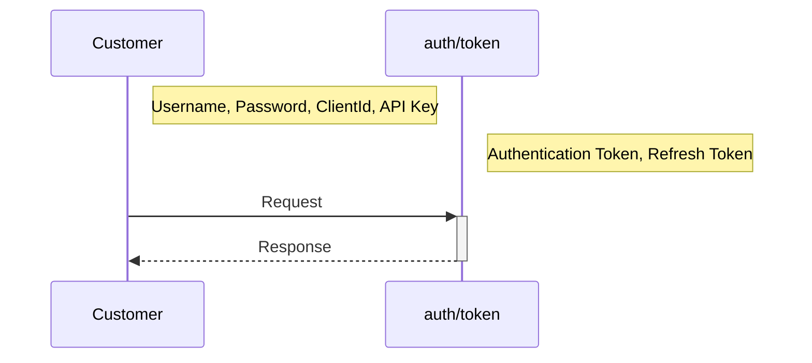

## Getting Started

:::info Applicable Versions

The code examples provided do not apply to Tenovos API version 2.x.

:::

The information below provides the fundamental information needed to get started with using the Tenovos API.  
Code examples provided are written in JavaScript using Node.js 16.  

This page contains helper utilities that are useful not only for the examples laid out in the exercises on the portal, but for nearly all API calls that you we have.  They provide reuse for common things like getting metadata templates, vocabularies and security templates, which are required in many requests.

**The below files are provided after the authentication example and referenced throughout the training exercises:**
- config/common.js
- data/collection.js
- helper/create-collections-helper.js
- service/asset-search.js
- service/collection.js
- service/metadata-definition.js
- service/metadata-template.js
- service/security-template.js

### Creating an HTTP Utility

When making API calls to the Tenovos API, you will need to make several calls as part of a sequence in order to perform various functions, like creating Asset Relationships, end-to-end.  To avoid duplication of code for making these requests, the below HTTP utility provides a way of doing this in a reusable manner.  All of our training exercises leverage this utility.

### Code Dependencies

- Code examples are written in Javascript using Node.js 16.
- Node Package Manager (NPM) modules are used and will need to be installed, including:
    - Lodash
    - Request

Using npm:
```
npm i -g lodash
npm i -g node-fetch
```

### HTTP Utility Example

##### **`util/http.js`**
```javascript
const Fetch = require('node-fetch');
const getResponseBody = async (response, options) => {
  const responseType = options?.responseType || 'json';
  let responseBody;
  // Format Response Body based on Response Type Option
  if (responseType === 'json') {
    responseBody = response.json();
  } else if (responseType === 'text') {
    responseBody = response.text();
  } else if (responseType === 'arrayBuffer') {
    responseBody = response.arrayBuffer();
  } else if (responseType === 'buffer') {
    responseBody = response.buffer();
  } else if (responseType === 'blob') {
    responseBody = response.blob();
  } else {
    console.log('Invalid HTTP Response Type:', responseType);
    // Default to JSON Response Body
    responseBody = response.json();
  }
  return responseBody;
};
const sendHttpRequest = async (request) => {
  // console.log('HTTP Request:', request)
  const { url, method, headers, body, options } = request;
  // Prepare HTTP Request
  const httpRequest = {
    headers,
    method,
  };
  // Prepare Request Body
  let requestBody = body || '';
  // Stringify Object Body
  if (requestBody) {
    if (typeof body === 'object') {
      requestBody = JSON.stringify(body);
    }
    httpRequest.body = requestBody;
  }
  // Send HTTP Request
  const response = await Fetch(url, httpRequest);
  // Extract Response Body
  const responseBody = await getResponseBody(response, options);
  // Prepare Result
  return {
    headers: response.headers,
    statusCode: response.status,
    statusMessage: response.statusText,
    body: responseBody,
  };
};
module.exports = {
  sendHttpRequest,
};
```

### Requirements
- API Key for your UAT and/or Production Environment.  If you do not have your API key, you may contact [Tenovos Support](http://support.tenovos.com)
- A local user account within your UAT and/or Production account.  We recommend that you name this user ***functional-api-user*** so that you can easily identify it within event logs and reports.  If you have, or will have, multiple integrations, you may wish to consider an integration specific username, i.e., ***functional-api-cms*** or ***functional-api-piim***
- The above user account needs to be part of a role and group with adequate privileges and permissions to perform the actions you will carry out via the API

### Constraints
- The Authorization Token provided by the ***/auth/token*** endpoint is valid for 60 minutes.  You should implement error handling on all calls to account for an unauthorized error and use the refresh token to renew your session.
- The results of each response from the Tenovos API are constrained to the permissions of the user account being used.

### Authentication Process

***

### Authentication Code Example
This example prepares an Authentication request, submits the request, and extracts the Authorization from the Response.  
Notes:
- Enter a valid Endpoint URL
- Replace the following < > variables with your values
- Enter a correct Content-Length value as the length of the body text

#### **`service/authentication.js`**
```javascript
const HttpUtil = require('../util/http');
const authenticate = async (request) => {
  console.log('authenticate Request:', request);
  // Extract Parameters from Request
  const { endpointUrl, apiKey, clientId, username, password } = request;
  // Prepare Request Body
  const body = {
    clientId,
    username,
    password,
  };
  // Get Body Content Length
  const bodyLength = Buffer.byteLength(JSON.stringify(body));
  // Prepare HTTP Request
  const httpRequest = {
    method: 'POST',
    url: `${endpointUrl}/auth/token`,
    headers: {
      'Content-Type': 'application/json',
      Accept: 'application/json',
      'x-api-key': apiKey,
      'Content-Length': bodyLength,
    },
    body,
  };
  // Send HTTP Request, Get HTTP Result
  const result = await HttpUtil.sendHttpRequest(httpRequest);
  console.log('authenticate Result:', result);
  // Extract Authorization from HTTP Result
  const authorization = result.body;
  console.log(authorization);
  // Return Authorization
  return authorization;
};
module.exports = {
  authenticate,
};
```

---
## Helper Utilities

### API Configuration Helper
Utility functions to get api-configuration and credentials for API User.

#### **`config/common.js`**
```javascript
const getApiConfig = () => {
 const endpointUrl = process.env.BASE_URL;
 const apiKey = process.env.API_KEY;
 return {
   endpointUrl,
   apiKey,
 };
};
const getCredentials = () => {
 const clientId = process.env.CLIENT_ID;
 const username = process.env.USER_NAME;
 const password = process.env.PASSWORD;
 return {
   clientId,
   username,
   password,
 };
};
module.exports = {
 getApiConfig,
 getCredentials,
};

```
### Collection Data Helper
Example request data for create-collection-helper.js to create request parameters.

#### **`data/collection.js`**
```javascript
const createCollectionRecords = [
 {
   assetSearches: [
     {
       searchTerm: ['video'],
     },
   ],
   metadataTemplate: {
     templateName: 'Secured Collections',
   },
   metadata: {
     collection_name: 'Private Photos 001',
     collection_priority: 'Medium',
   },
   securityTemplates: [],
   collection: {
     collectionType: 'privateSecured',
   },
 },
];
module.exports = {
 createCollectionRecords,
};
```

### Create Collections Helper
Helper function to combine different api-calls to create-collection with appropriate data i.e., metadata-template, security-template, and a list of assets.

#### **`helper/create-collections-helper.js`**
```javascript
const AuthenticationService = require('../service/authentication');
const AssetSearchService = require('../service/asset-search');
const CollectionService = require('../service/collection');
const MetadataTemplateService = require('../service/metadata-template');
const SecurityTemplateService = require('../service/security-template');
const MetadataHelper = require('./metadata');
const CommonConfig = require('../config/common');
const CollectionData = require('../data/collection');
/**
* This function is the entry point for the create-collection example.
* Here are the steps that it follows to create a collection:
* Authenticate user / Get Authorization Token.
* Fetch metadata-templates.
* Fetch security-templates.
* Search assets to get a list of assets that are to be added to the newly created collection.
* Send request to create-collection
* @returns {Promise<void>}
*/
const createCollections = async () => {
 try {
   // Get API Config
   const apiConfig = CommonConfig.getApiConfig();
   // Get Credentials
   const credentials = CommonConfig.getCredentials();
   // Prepare Authentication Request
   const authenticateRequest = {
     ...apiConfig,
     ...credentials,
   };
   // Submit Authentication Request and Get Authorization
   const authenticateResult = await AuthenticationService.authenticate(authenticateRequest);
   const { authorization, accessToken } = authenticateResult.session;
   // Prepare Authorized Request Context
   const requestContext = {
     ...apiConfig,
     authorization,
     accessToken,
   };
   // Get Metadata Templates
   const allMetadataTemplates = await MetadataTemplateService.getAllMetadataTemplates(requestContext);
   // Get Security Templates
   const allSecurityTemplates = await SecurityTemplateService.getAllSecurityTemplates(requestContext);
   // Get Bulk Create Collection Records
   const { createCollectionRecords } = CollectionData;
   // Cache Controlled Vocabulary Map
   const controlledVocabularyMap = {};
   // Loop to Create New Collections
   for (let i = 0; i < createCollectionRecords.length; i += 1) {
     const createCollectionRecord = createCollectionRecords[i];
     try {
       const { assetSearches, metadataTemplate, metadata, collection, securityTemplates } = createCollectionRecord;
       const { collectionType } = collection;
       // Prepare Asset Searches Request
       const searchRequest = {
         assetSearches,
         requestContext,
       };
       // Run Run Asset Searches and Retrieve All Assets from Searches
       // eslint-disable-next-line no-await-in-loop
       const searchResult = await AssetSearchService.runAssetSearches(searchRequest);
       // Loop to Extract Asset File IDs to Add to Collection
       const assetFileIds = searchResult.map((asset) => asset.fileId);
       // Must Have Asset File IDs to Add to Collection
       if (!assetFileIds.length) {
         const message = 'No Assets Found to Add to Collection by Search.  Skip Collection Creation';
         console.error(message, {
           assetSearches,
         });
         throw new Error(message);
       }
       // Retrieve Metadata Template ID Given Template Name
       const { templateName: metadataTemplateName } = metadataTemplate;
       const validMetadataTemplate = allMetadataTemplates.find(
         (template) => template.templateName === metadataTemplateName,
       );
       const metadataTemplateId = validMetadataTemplate?.templateId;
       // Validate Metadata Template ID
       if (!metadataTemplateId) {
         throw new Error(`Invalid Metadata Template Name: ${metadataTemplateName}`);
       }
       // Convert Metadata into Metadata Document
       // eslint-disable-next-line no-await-in-loop
       const metadataDocument = await MetadataHelper.convertMetadataToDocument(
         metadata,
         validMetadataTemplate,
         controlledVocabularyMap,
         requestContext,
       );
       let validSecurityTemplateIds = [];
       // For Shared Collections, Retrieve Security Template IDs
       if (Array.isArray(securityTemplates)) {
         // Retrieve Security Template IDs Given Template Names
         validSecurityTemplateIds = securityTemplates.reduce(
           (validTemplateIds, securityTemplate) => {
             const { templateName } = securityTemplate;
             // Find Matching Security Template Given Template Name
             const validTemplate = allSecurityTemplates.find(
               (template) => template.templateName === templateName,
             );
             // Validate Template
             if (!validTemplate) {
               throw new Error(`Invalid Security Template Name: ${templateName}`);
             }
             // Add Security Template ID to Valid List
             validTemplateIds.push(validTemplate.templateId);
             return validTemplateIds;
           },
           [],
         );
       }
       // Shared Collection Must Have Security Templates
       if (collectionType === 'secured' && !validSecurityTemplateIds.length) {
         if (!validSecurityTemplateIds.length) {
           throw new Error('Missing Security Template Names');
         }
       }
       // Prepare Create Collection Request
       const request = {
         collection: {
           name: metadata.collection_name,
           collectionType: collection.collectionType,
           metadataTemplateId,
           metadataDocument,
           securityTemplateIds: validSecurityTemplateIds,
           collectionDocument: assetFileIds,
         },
         ...requestContext,
       };
       console.log('Create Collection Request', request);
       // Create Collection
       // eslint-disable-next-line no-await-in-loop
       const result = await CollectionService.createCollection(request);
       // Log Result
       console.log('Create Collection Result:', {
         request,
         result,
       });
     } catch (error) {
       console.error(
         'Failed to Create Collection:',
         error.message,
         {
           record: createCollectionRecord,
         },
         error.stack,
       );
     }
   }
 } catch (error) {
   console.error('Failed to Process Create Collections:', error.message, error.stack);
 }
};

createCollections()
 .then(console.log)
 .catch(console.error);

```

### Asset Search Helper
Search Assets based on keyword being used to create list of assets to add in collection

#### **`service/asset-search.js`**
```javascript
const HttpUtil = require('../util/http');
const AssetSearchConfig = require('../config/asset-search');
const runKeywordSearch = async (request) => {
 // Extract Parameters from Request
 const { endpointUrl, apiKey, authorization, search, accessToken } = request;
 // Prepare Request Body
 const body = {
   from: 0,
   searchTerm: ['*'],
   sortBy: [
     {
       metadataDefinitionSearchField: 'createdepoch',
       order: 'desc',
     },
   ],
   operation: 'AND',
   limit: AssetSearchConfig.common.SEARCH_RESULT_LIMIT,
   filters: [],
   excludes: [
     'technicalMetadataDocument',
     'metadataDocument.text_content',
   ],
 };
 // Override Default Search with Custom Search Parameters
 if (search) {
   Object.assign(body, search);
 }
 // Get Body Content Length
 const bodyLength = Buffer.byteLength(JSON.stringify(body));
 // Prepare HTTP Request
 const httpRequest = {
   method: 'POST',
   url: `${endpointUrl}/search/keyword`,
   headers: {
     Accept: 'application/json',
     Authorization: authorization,
     accessToken,
     'Content-Length': bodyLength,
     'Content-Type': 'application/json',
     'x-api-key': apiKey,
   },
   body,
 };
 // Send HTTP Request, Get HTTP Result
 const result = await HttpUtil.sendHttpRequest(httpRequest);
 // Extract Search Result from HTTP Result
 const searchResult = result.body;
 // Return Search Result
 return searchResult;
};
/**
* @description Retrieve Assets given an Array of Asset Search Requests.
* Iterate over all Search Results and aggregate Assets into a unique Array of Assets.
* Return the unique Asset Array.
* @param {{assetSearches, requestContext}} request
* @returns {Promise<Array>} Array of Assets
*/
const runAssetSearches = async (request) => {
 const { assetSearches, requestContext } = request;
 const assetMap = {};
 // Validate Parameters
 if (!(Array.isArray(assetSearches) && assetSearches.length)) {
   throw new Error('assetSearches must be a non-empty Array');
 }
 if (!requestContext) {
   throw new Error('Missing requestContext');
 }
 // Loop to Search for Assets and Aggregate in a Map to Prevent Duplicates
 for (let i = 0; i < assetSearches.length; i += 1) {
   const assetSearch = assetSearches[i];
   // Get Search Parameters
   const { searchTerm } = assetSearch;
   // Start from Asset 0
   let searchIndex = 0;
   const searchResultLimit = AssetSearchConfig.common.SEARCH_RESULT_LIMIT;
   // Search for Assets using Search Terms
   while (searchIndex >= 0) {
     // Prepare Search Request
     const search = {
       from: searchIndex,
       limit: searchResultLimit,
       searchTerm,
     };
     const searchRequest = {
       ...requestContext,
       search,
     };
     // Run Asset Search
     // eslint-disable-next-line no-await-in-loop
     const searchResult = await runKeywordSearch(searchRequest);
     // Loop to Add Search Result Assets to Map
     searchResult.result.forEach((asset) => {
       const { objectId } = asset;
       // Add Asset to Map
       assetMap[objectId] = asset;
     });
     // If Current Result Hit Count Equal to Batch Size, Get Next Search Result Page
     if (searchResult.hitCount === searchResultLimit) {
       searchIndex += searchResultLimit;
     } else {
       // Else Stop Searching
       searchIndex = -1;
     }
   }
 }
 const assets = [];
 // Convert Asset Map to Array
 Object.values(assetMap).forEach((asset) => {
   assets.push(asset);
 });
 // Return Assets
 return assets;
};
module.exports = {
 runKeywordSearch,
 runAssetSearches,
};

```

### Metadata Vocabulary Helper
Invokes rest API to get a list of vocabularies’ metadata to be used in create-collection flow.

#### **`service/metadata-definition.js`**
```javascript
const HttpUtil = require('../util/http');
const getControlledVocabulary = async (request) => {
 // Extract Parameters from Request
 const { endpointUrl, apiKey, authorization, accessToken, controlledVocabularyId } = request;
 const httpRequest = {
   method: 'GET',
   url: `${endpointUrl}/metadata/vocabulary/${controlledVocabularyId}`,
   headers: {
     Accept: 'application/json',
     Authorization: authorization,
     accessToken,
     'x-api-key': apiKey,
   },
 };
 // Send HTTP Request, Get HTTP Result
 const result = await HttpUtil.sendHttpRequest(httpRequest);
 // Extract Controlled Vocabulary from Result
 const controlledVocabulary = result.body;
 // Return Controlled Vocabulary
 return controlledVocabulary;
};
module.exports = {
 getControlledVocabulary,
};
```

### Metadata Template Helper
Invokes rest API to get a list of metadata-templates to be used in create-collection flow.

#### **`service/metadata-template.js`**

```javascript
const HttpUtil = require('../util/http');
/**
* This function fetches all metadata-templates of a customer
* @param request
* @returns {Promise<Object|String|ArrayBuffer|Buffer|Blob>}
*/
const getAllMetadataTemplates = async (request) => {
 // Extract Parameters from Request
 const { endpointUrl, apiKey, authorization, accessToken } = request;
 // Prepare HTTP Request
 const httpRequest = {
   method: 'GET',
   url: `${endpointUrl}/metadata/template`,
   headers: {
     Accept: 'application/json',
     Authorization: authorization,
     accessToken,
     'x-api-key': apiKey,
   },
 };
 // Send HTTP Request, Get HTTP Result
 const result = await HttpUtil.sendHttpRequest(httpRequest);
 // Extract Metadata Templates from HTTP Result
 const metadataTemplates = result.body;
 // Return Search Result
 return metadataTemplates;
};
/**
* This function fetches one metadata-template by template-id
* @param request
* @returns {Promise<Object|String|ArrayBuffer|Buffer|Blob>}
*/
const getMetadataTemplate = async (request) => {
 // Extract Parameters from Request
 const { endpointUrl, apiKey, authorization, templateId } = request;
 // Prepare HTTP Request
 const httpRequest = {
   method: 'GET',
   url: `${endpointUrl}/metadata/template/${templateId}`,
   headers: {
     Accept: 'application/json',
     Authorization: authorization,
     'x-api-key': apiKey,
   },
 };
 // Send HTTP Request, Get HTTP Result
 const result = await HttpUtil.sendHttpRequest(httpRequest);
 // Extract Metadata Templates from HTTP Result
 const metadataTemplates = result.body;
 // Return Search Result
 return metadataTemplates;
};
module.exports = {
 getAllMetadataTemplates,
 getMetadataTemplate,
};

```

### Security Template Helper
Invokes rest API to get a list of security-templates to be used in create-collection flow.

#### **`service/security-template.js`**
```javascript
const HttpUtil = require('../util/http');
/**
* This function fetches all security-templates of a customer
* @param request
* @returns {Promise<Object|String|ArrayBuffer|Buffer|Blob>}
*/
const getAllSecurityTemplates = async (request) => {
 // Extract Parameters from Request
 const { endpointUrl, apiKey, authorization, accessToken } = request;
 // Prepare HTTP Request
 const httpRequest = {
   method: 'GET',
   url: `${endpointUrl}/security/template`,
   headers: {
     Accept: 'application/json',
     Authorization: authorization,
     accessToken,
     'x-api-key': apiKey,
   },
 };
 // Send HTTP Request, Get HTTP Result
 const result = await HttpUtil.sendHttpRequest(httpRequest);
 // Extract Security Templates from HTTP Result
 const securityTemplates = result.body;
 // Return Search Result
 return securityTemplates;
};
module.exports = {
 getAllSecurityTemplates,
};

```