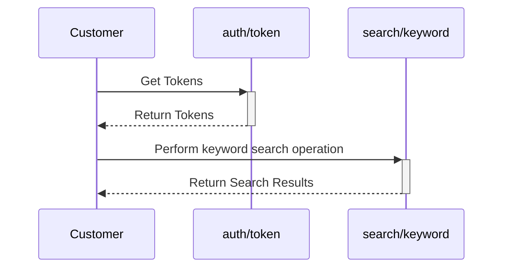

## Searching for Assets in Tenovos

This source file includes a function runKeywordSearch() that performs the following steps:
- Prepares an authorized HTTP request to perform an Asset Keyword Search.
- Submits the API request and receives a response.
- Extracts the search result from the response.
- Returns the search result.


### Requirements

- The following properties must be included in the function’s request parameter:
    - endpointUrl
    - apiKey
    - Authorization
- Optional **request** properties:
    - search - Search query object.  The included properties will override the default properties provided by this function.
- Populate the search request body properties:
    - excludes: (Optional) List of properties, using dot-notation, to exclude from the result set to minimize the amount of data returned.
    - from: 0-based offset of first Asset to return from search result.
    - filters: Array of Search Filters to constrain the search results.
        - Format: '("Dropdown Attribute Name":”Value”)'
    - limit: Number of Assets to return starting from the **from** index position of the search result. (Max: 100)
    - searchTerm: Array of search terms.
    - sortBy: Asset property or sortable Metadata Attribute used to sort search results.
    - metadataDefinitionSearchField: createdEpoch | lastUpdatedEpoch | <Sortable metadata_definition_search_field>
    - order: asc | desc

### Constraints
- The user account used to obtain the auth token must have access to the Metadata Template applied to the asset.  Access Templates when applied may revoke this.
- The user account used to obtain the auth token must be part of a user group that has the ***Apply Security Template*** permission on the Security Template being used.
- Results are paginated using the from property in your request.  ***The maximum number of search results is limited to 10,000***.

### Process

The sequence diagram below shows the typical process to search for assets using keywords and/or filters within Tenovos using the REST API.


***

### Code Example

The below example assumes use of the HTTP Utility and that you have a valid token returned from the authentication service, as described in [Getting Started with Authentication and HTTP Utility](authenticating.md)

#### **`service/asset-search.js`**
```javascript
    const HttpUtil = require('./util/http');
    const AssetSearchConfig = require('../config/asset-search');
    const runKeywordSearch = async (request) => {
    // Extract Parameters from Request
    const { endpointUrl, apiKey, authorization, search } = request;

    // Prepare Request Body
    const body = {
    from: 0,
    searchTerm: ['*'],
    sortBy: [
        {
        metadataDefinitionSearchField: 'createdepoch',
        order: 'desc',
     },
   ],
   operation: 'AND',
   limit: 50,
   filters: [],
   excludes: [
     'technicalMetadataDocument',
     'metadataDocument.text_content',
   ],
 };
 // Override Default Search with Custom Search Parameters
 if (search) {
   Object.assign(body, search);
 }
 // Get Body Content Length
 const bodyLength = Buffer.byteLength(JSON.stringify(body));

 // Prepare HTTP Request
 const httpRequest = {
   method: 'POST',
   url: `${endpointUrl}/search/keyword`,
   headers: {
     Accept: 'application/json',
     Authorization: authorization,
     'Content-Length': bodyLength,
     'Content-Type': 'application/json',
     'x-api-key': apiKey,
   },
   body,
 };
 // Send HTTP Request, Get HTTP Result
 const result = await HttpUtil.sendHttpRequest(httpRequest);
 // Extract Search Result from HTTP Result
 const searchResult = result.body;
 // Return Search Result
 return searchResult;
};

/**
* @description Retrieve Assets given an Array of Asset Search Requests.
* Iterate over all Search Results and aggregate Assets into a unique Array of Assets.
* Return the unique Asset Array.
* @param {{assetSearches, requestContext}} request
* @returns {Promise<Array>} Array of Assets
*/
const runAssetSearches = async (request) => {
 const { assetSearches, requestContext } = request;
 const assetMap = {};
 // Validate Parameters
 if (!(Array.isArray(assetSearches) && assetSearches.length)) {
   throw new Error('assetSearches must be a non-empty Array');
 }
 if (!requestContext) {
   throw new Error('Missing requestContext');
 }
 // Loop to Search for Assets and Aggregate in a Map to Prevent Duplicates
 for (let i = 0; i < assetSearches.length; i += 1) {
   const assetSearch = assetSearches[i];
   // Get Search Parameters
   const { searchTerm } = assetSearch;
   // Start from Asset 0
   let searchIndex = 0;
   const searchResultLimit = AssetSearchConfig.common.SEARCH_RESULT_LIMIT;
   // Search for Assets using Search Terms
   while (searchIndex >= 0) {
     // Prepare Search Request
     const search = {
       from: searchIndex,
       limit: searchResultLimit,
       searchTerm,
     };
     const searchRequest = {
       ...requestContext,
       search,
     };
     // Run Asset Search
     // eslint-disable-next-line no-await-in-loop
     const searchResult = await runKeywordSearch(searchRequest);
     // Loop to Add Search Result Assets to Map
     searchResult.result.forEach((asset) => {
       const { objectId } = asset;
       // Add Asset to Map
       assetMap[objectId] = asset;
     });
     // If Current Result Hit Count Equal to Batch Size, Get Next Search Result Page
     if (searchResult.hitCount === searchResultLimit) {
       searchIndex += searchResultLimit;
     } else {
       // Else Stop Searching
       searchIndex = -1;
     }
   }
 }
 const assets = [];
 // Convert Asset Map to Array
 Object.values(assetMap).forEach((asset) => {
   assets.push(asset);
 });
 // Return Assets
 return assets;
};
module.exports = {
 runKeywordSearch,
 runAssetSearches,
};
```