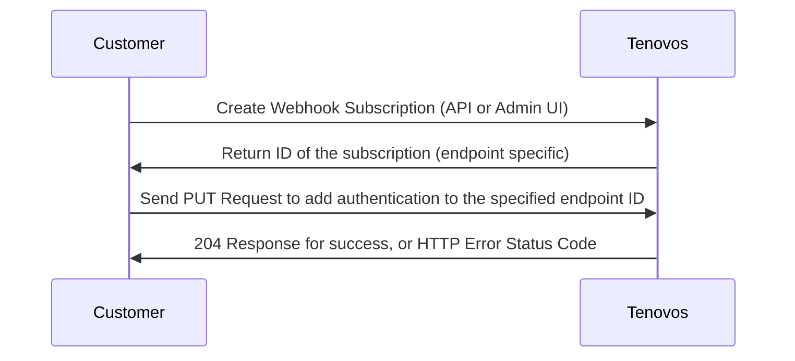
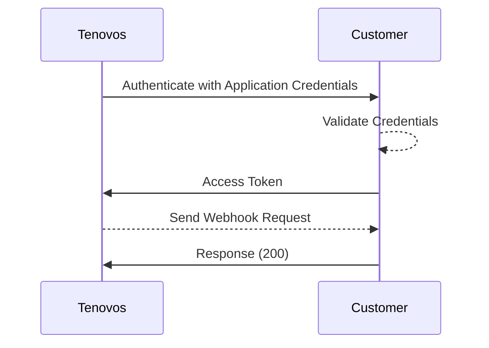

# Webhook Authentication
---

Tenovos supports authenticating webhook requests using OAuth 2.0 `client credentials` flow, as well as open/no authentication.  If not using OAuth, the time and signature in the headers of each webhook request should be validated per the [Validation Documentation](validation.md).

## Using OAuth Client Credentials

In order to subscribe to an event, Tenovos customers must create an endpoint subscription via the Tenovos Rest API, or via the Webhooks section of the Administration UI.  Upon successful completion of creating a new endpoint subscription, a unique ID is returned.  This ID is specific to the endpoint subscription and the events you've subscribed to.  

For example, you may only want to subscribe to one event(asset.created), or multiple (asset.created, asset.deleted, user.created), all of which get published to the single endpoint url you've specified at the time of creating the subscription.  The endpoint url is the url owned and operated by the Tenovos Customer to which Tenovos will post all webhook event payloads for events that are part of the subscription for this endpoint.  **This ID will be needed to add OAuth authentication for all requests sent to your endpoint url.**

### Prerequisites

If you require OAuth for webhook authentication, prior to creating the webhook subscription you'll need to create a new client from your OAuth server/provider.  This will generate a client ID and client secret that you will send to Tenovos.  

:::info
It is recommended that a new client be generated for each webhook endpoint that is created.
:::

The diagram below outlines the step by step process for creating a new webhook subscription and adding OAuth to it.  For documentation about the PUT request you'll need to send after creating the subscription, please reference the [API Endpoint Reference]().



### How to provide OAuth Client Credentials to Tenovos

After completion of the prerequisites and creation of the subscription endpoint (via API or Admin UI), when generating the PUT request to add OAuth authentication, the JSON body of the PUT will look like the example below.

- `clientId`:  This is the ID generated from your OAuth provider that you will add to Tenovos
- `tokenUrl`:  This is the url of your OAuth provider that Tenovos will pass the clientId and clientSecret to in order to obtain and access token
- `clientSecret`: This is the secret generated from your OAuth provider that Tenovos will use for Authenticating
- `extraParams`: This is an optional object field that can be used to provide audience and other parameters that your OAuth provider may require
- `scope`: Many OAuth providers require scope.  Scope is configured on your OAuth provider at the time of creating the client.  

```
PUT: https://enterprise.services.tenovos.io/content-store-v1/webhooks/endpoint/oauth/{endpointId}

```

```json
{
    "clientId":  "FbhKdCwuiItoSSRJpKXc6cjhpJFVy7JbB",
    "tokenUrl": "https://yourauthprovider.com/oauth/token",
    "clientSecret":"458Gfd7774Gb1niGYu1JT9xfQobecM0i5UGOp_F5BU6DdGFEDCvz7r0xObfdf458Bn",
    "extraParams": {"audience": "http://yourdomain.tenovos.io"},
    "scope": [""]
}

```


## Basic OAuth Flow Example



