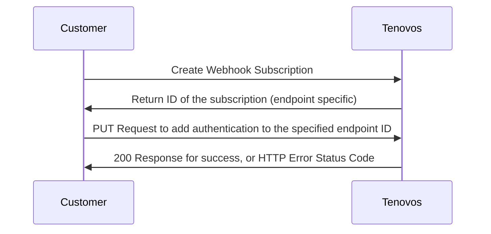

# Webhook Authentication
---

Tenovos supports authenticating webhook requests using OAuth 2.0 `client credentials` flow, as well as open/no authentication.  If not using OAuth, the timetime and signature in the headers of each webhook request should be validated per the [Validation Documentation](validation.md).

## Using OAuth Client Credentials

In order to subscribe to an event, Tenovos customers must create an endpoint subscription via the Tenovos Rest API, or via the Webhooks section of the Administration UI.  Upon successful completion of creating a new endpoint subscription, a unique ID is returned.  This ID is specific to the endpoint subscription and the events you've subscribed to.  

For example, you may only want to subscribe to one event(asset.created), or multiple (asset.created, asset.deleted, user.created), all of which get published to the single endpoint url you've specificed at the time of creating the subscription.  The endpoint url is the url owned and operated by the Tenovos Cusotmer to which Tenovos will post all webhook event payloads for events that are part of the subscription for this endpoint.  **This ID will be needed to add OAuth authentication for all requests sent to your endpoint url.**




```json
{
    "clientId":  "FbhKdCwuiItoIssJpKXc6cjhpJFVy7JbB",
    "tokenUrl": "https://auth.tenovos.io/oauth/token",
    "clientSecret":"458Gfd7p5SdUwNYu1JT9xfQobecM0i5UGOp_F5BU6DdAOPFLZDz7r0xObfdf67Ki3",
    "extraParams": {"audience": "http://yourdomain.tenovos.io"},
    "scope": [""]
}
``````
---


